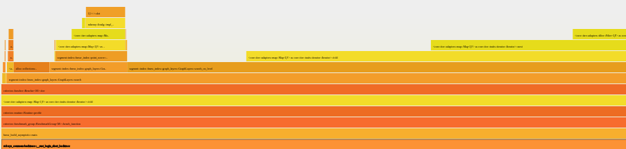
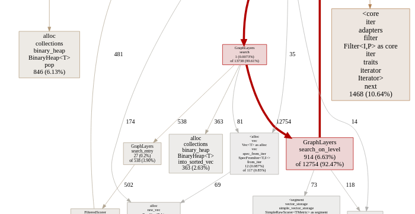

# Developer's guide to Qdrant


## Build Qdrant

### Docker 🐳

Build your own from source

```bash
docker build . --tag=qdrant/qdrant
```

Or use latest pre-built image from [DockerHub](https://hub.docker.com/r/qdrant/qdrant)

```bash
docker pull qdrant/qdrant
```

To run the container, use the command:

```bash
docker run -p 6333:6333 qdrant/qdrant
```

And once you need a fine-grained setup, you can also define a storage path and custom configuration:

```bash
docker run -p 6333:6333 \
    -v $(pwd)/path/to/data:/qdrant/storage \
    -v $(pwd)/path/to/custom_config.yaml:/qdrant/config/production.yaml \
    qdrant/qdrant
```

* `/qdrant/storage` - is a place where Qdrant persists all your data.
Make sure to mount it as a volume, otherwise docker will drop it with the container.
* `/qdrant/config/production.yaml` - is the file with engine configuration. You can override any value from the [reference config](https://github.com/qdrant/qdrant/blob/master/config/config.yaml)

Now Qdrant should be accessible at [localhost:6333](http://localhost:6333/).


### Local development
#### Linux/Debian/MacOS
To run Qdrant on local development environment you need to install below:
- Install Rust, follow: [install rust](https://www.rust-lang.org/tools/install)
- Install `rustfmt` toolchain for Rust
    ```shell
    rustup component add rustfmt
    ```
- Install dependencies:
    ```shell
    sudo apt-get update -y
    sudo apt-get upgrade -y
    sudo apt-get install -y curl unzip gcc-multilib \
        clang cmake jq \
        g++-9-aarch64-linux-gnu \
        gcc-9-aarch64-linux-gnu
    ```
- Install `protoc` from source
    ```shell
    PROTOC_VERSION=22.2
    PKG_NAME=$(uname -s | awk '{print ($1 == "Darwin") ? "osx-universal_binary" : (($1 == "Linux") ? "linux-x86_64" : "")}')

    # curl `proto` source file
    curl -LO https://github.com/protocolbuffers/protobuf/releases//download/v$PROTOC_VERSION/protoc-$PROTOC_VERSION-$PKG_NAME.zip

    unzip protoc-$PROTOC_VERSION-$PKG_NAME.zip -d $HOME/.local

    export PATH="$PATH:$HOME/.local/bin"

    # remove source file if not needed
    rm protoc-$PROTOC_VERSION-$PKG_NAME.zip

    # check installed `protoc` version
    protoc --version
    ```
- Build and run the app
    ```shell
    cargo build --release --bin qdrant

    ./target/release/qdrant
    ```
- Use the web UI

    Web UI repo is [in a separate repo](https://github.com/qdrant/qdrant-web-ui), but there's a utility script to sync it to the `static` folder:
    ```shell
    ./tools/sync-web-ui.sh
    ```

## Profiling

There are several benchmarks implemented in Qdrant. Benchmarks are not included in CI/CD and might take some time to execute.
So the expected approach to benchmarking is to run only ones which might be affected by your changes.

To run benchmark, use the following command inside a related sub-crate:

```bash
cargo bench --bench name_of_benchmark
```

In this case you will see the execution timings and, if you launched this bench earlier, the difference in execution time.

Example output:

```
scoring-vector/basic-score-point
                        time:   [111.81 us 112.07 us 112.31 us]
                        change: [+19.567% +20.454% +21.404%] (p = 0.00 < 0.05)
                        Performance has regressed.
Found 9 outliers among 100 measurements (9.00%)
  3 (3.00%) low severe
  3 (3.00%) low mild
  2 (2.00%) high mild
  1 (1.00%) high severe
scoring-vector/basic-score-point-10x
                        time:   [111.86 us 112.44 us 113.04 us]
                        change: [-1.6120% -0.5554% +0.5103%] (p = 0.32 > 0.05)
                        No change in performance detected.
Found 1 outliers among 100 measurements (1.00%)
  1 (1.00%) high mild
```


### FlameGraph and call-graph visualisation
To run benchmarks with profiler to generate FlameGraph - use the following command:

```bash
cargo bench --bench name_of_benchmark -- --profile-time=60
```

This command will run each benchmark iterator for `60` seconds and generate FlameGraph svg along with profiling records files.
These records could later be used to generate visualisation of the call-graph.



Use [pprof](https://github.com/google/pprof) and the following command to generate `svg` with a call graph:

```bash
~/go/bin/pprof -output=profile.svg -svg ${qdrant_root}/target/criterion/${benchmark_name}/${function_name}/profile/profile.pb
```



### Real-time profiling

Qdrant have basic [`tracing`] support with [`Tracy`] profiler and [`tokio-console`] integrations
that can be enabled with optional features.

- [`tracing`] is an _optional_ dependency that can be enabled with `tracing` feature
- `tracy` feature enables [`Tracy`] profiler integration
- `console` feature enables [`tokio-console`] integration
  - note, that you'll also have to [pass `--cfg tokio_unstable` arguments to `rustc`][tokio-tracing] to enable this feature
  - by default [`tokio-console`] binds to `127.0.0.1:6669`
  - if you want to connect [`tokio-console`] to Qdrant instance running inside a Docker container
    or on remote server, you can define `TOKIO_CONSOLE_BIND` when running Qdrant to override it
    (e.g., `TOKIO_CONSOLE_BIND=0.0.0.0:6669` to listen on all interfaces)
- `tokio-tracing` feature explicitly enables [`Tokio` crate tracing][tokio-tracing]
  - note, that you'll also have to [pass `--cfg tokio_unstable` arguments to `rustc`][tokio-tracing] to enable this feature
  - this is required (and enabled automatically) by the `console` feature
  - but you can enable it explicitly with the `tracy` feature, to see Tokio traces in [`Tracy`] profiler

Qdrant code is **not** instrumented by default, so you'll have to manually add `#[tracing::instrument]` attributes
on functions and methods that you want to profile.

Qdrant uses [`tracing-log`] as the [`log`] backend, so `log` and `log-always` features of the [`tracing`] crate
[should _not_ be enabled][tracing-log-warning]!

```rust
// `tracing` crate is an *optional* dependency in `lib/*` crates, so if you want the code to compile
// when `tracing` feature is disabled, you have to use `#[cfg_attr(...)]`...
//
// See https://doc.rust-lang.org/reference/conditional-compilation.html#the-cfg_attr-attribute
#[cfg_attr(feature = "tracing", tracing::instrument)]
fn my_function(some_parameter: String) {
    // ...
}

// ...or if you just want to do some quick-and-dirty profiling, you can use `#[tracing::instrument]`
// directly, just don't forget to add `--features tracing` when running `cargo` (or add `tracing`
// to default features in `Cargo.toml`)
#[tracing::instrument]
fn some_other_function() {
    // ...
}
```

[`tracing`]: https://docs.rs/tracing/latest/tracing/
[`Tracy`]: https://github.com/wolfpld/tracy
[`tokio-console`]: https://docs.rs/tokio-console/latest/tokio_console/
[tokio-tracing]: https://docs.rs/tokio/latest/tokio/#unstable-features
[`tracing-log`]: https://docs.rs/tracing-log/latest/tracing_log/
[`log`]: https://docs.rs/log/latest/log/
[tracing-log-warning]: https://docs.rs/tracing-log/latest/tracing_log/#caution-mixing-both-conversions

## API changes

### REST

Qdrant uses the [openapi](https://spec.openapis.org/oas/latest.html) specification to document its API.

This means changes to the API must be followed by changes to the specification.
This is enforced by CI.

Here is a quick step-by-step guide:

1. code endpoints and model in Rust
2. change specs in `/openapi/*ytt.yaml`
3. add new schema definitions to `src/schema_generator.rs`
4. run `/tools/generate_openapi_models.sh` to generate specs
5. update integration tests `tests/openapi/openapi_integration` and run them with `./tests/openapi_integration_test.sh`
6. expose file by starting an HTTP server, for instance `python -m http.server`, in `/docs/redoc`
7. validate specs by browsing redoc on `http://localhost:8000/?v=master`
8. validate `openapi-merged.yaml` using [swagger editor](https://editor.swagger.io/)

### gRPC

Qdrant uses [tonic](https://github.com/hyperium/tonic) to serve gRPC traffic.

Our protocol buffers are defined in `lib/api/src/grpc/proto/*.proto`

1. define request and response types using protocol buffers (use [oneOf](https://developers.google.com/protocol-buffers/docs/proto3#oneof) for enums payloads)
2. specify RPC methods inside the service definition using protocol buffers
3. `cargo build` will generate the struct definitions and a service trait
4. implement the service trait in Rust
5. start server `cargo run --bin qdrant`
6. run integration test `./tests/basic_grpc_test.sh`
7. generate docs `./tools/generate_grpc_docs.sh`

Here is a good [tonic tutorial](https://github.com/hyperium/tonic/blob/master/examples/routeguide-tutorial.md#defining-the-service) for reference.
