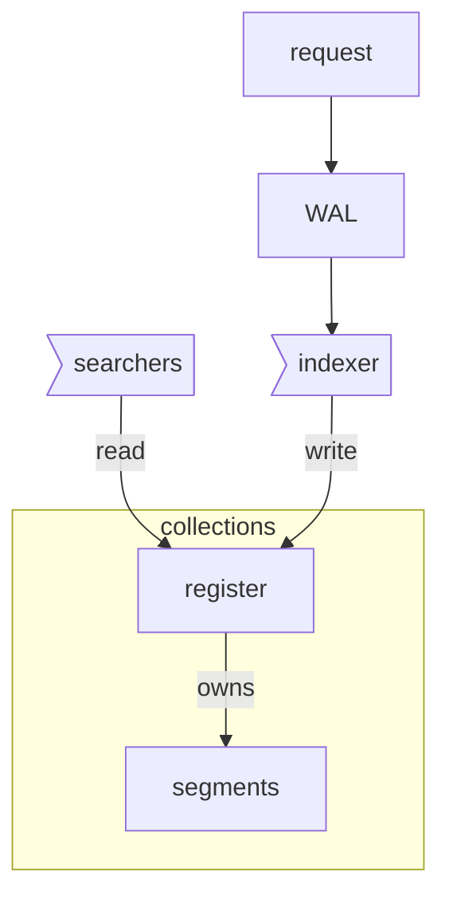
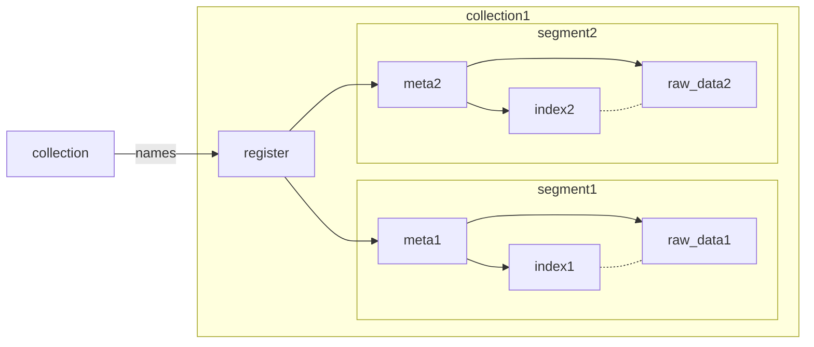

What guarantees should be provided:
 
- Once data is submitter successfully, it should not be lost (assuming power loss didn't happened in given persistence time interval).
- While indexing, power loss may appear in any moment. Index should not be corrupted.
- All submitted data should eventually be available.

## Update stages
### Initial structure

### Update

What could be updated? 

* Alter labels (Update or delete)
	* It involves index update + statistics update
* Insert new point
* Delete point
* Rename collection
* Optimize \ merge segments
* Collection dropped
* Collection created
