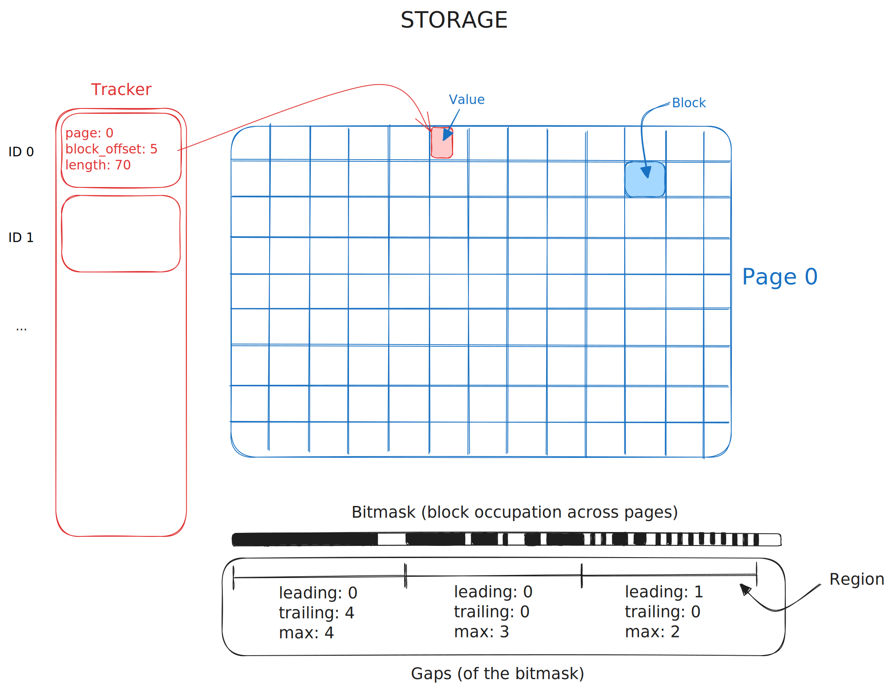

# blob_store

New storage for variable-sized values using mmap.

## Design

- IDs are sequential integers, starting at 0.
- The storage is divided into file pages of fixed size (32MB).
- Data can be written and read across multiple pages.
- Those pages are mapped into memory using mmap.
- Data units are blocks of fixed size (128 bytes).
- Values span an integer number of contiguous blocks.
- Values are compressed with lz4
- Each block is mapped to a bit in the bitmask.
- A region is a fixed number of contiguous blocks.
- Gaps of free blocks in each region are tracked in a file.
- Deletes mark the block as deleted (in-memory) & updates their region
- Updates:
  - not done in place, always a new value is inserted
  - calculation of the new regions gaps is done on the fly
  - the tracker is updated in-memory, only persisted on flush
- Supports multiple threads reading and single thread writing
- One file per page, one file for tracker, one file for bitmask, and one file for gaps.

## TODOs

- [ ] test data consistency on panic
- [ ] dictionary compression to optimize payload key repetition
- [ ] validate the usage with a block storage via HTTP range requests
