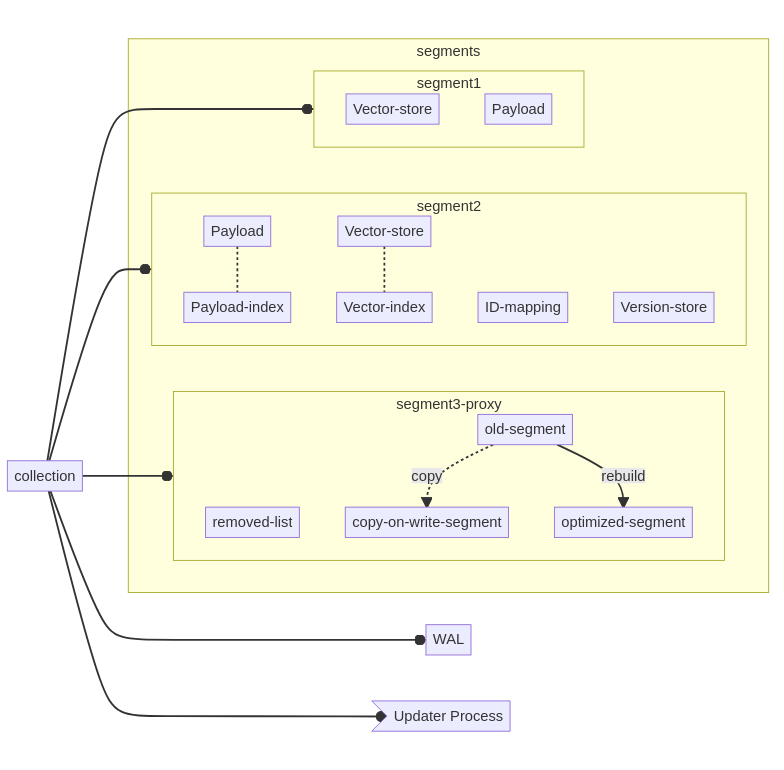
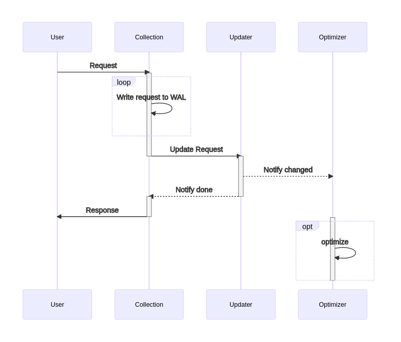

# Collection

Crate, which implements all functions required for operations with a single collection of points.
Points within a collection should share the same payload schema and have same vector size.
So that search requests could be performed over all points of a single collection.

## Structure

## Update process

