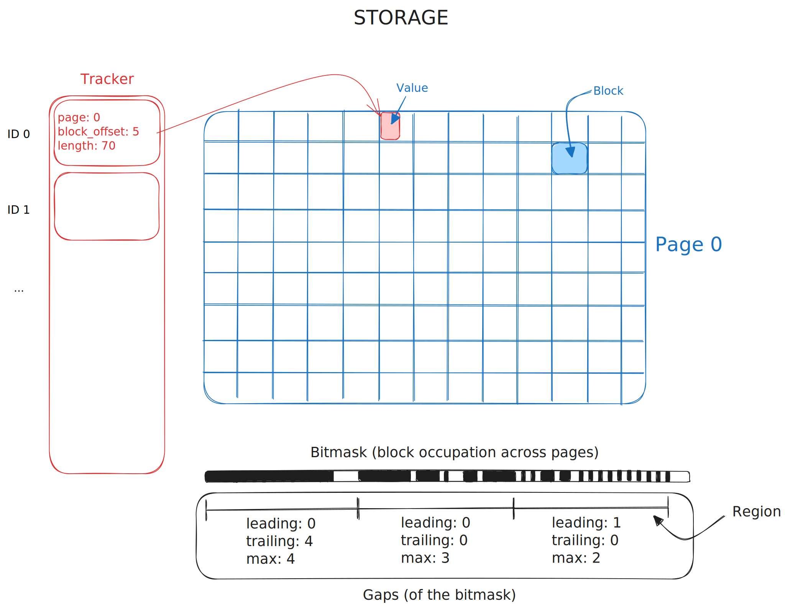

# gridstore

Storage for variable-sized values.

Operates in one of two modes, specified when creating a storage and selected
automatically when opening one, based on the persisted config:

- **dynamic** (default): read-write storage with in-place space reuse, backed
  by memory mapped files.
- **serverless**: append-only storage for serverless deployments, reading and
  writing files directly.

Concepts shared by both modes:

- IDs (point offsets) are sequential integers, starting at 0.
- Value data is stored in page file(s).
- Data units are blocks of fixed size (128 bytes by default).
- Values span an integer number of contiguous blocks.
- Values are compressed with lz4 (configurable).
- A tracker maps each point offset to page + block offset + value length. The
  tracker is updated in-memory, and only persisted on flush.
- Supports multiple threads reading and single thread writing.

## Dynamic mode

- The storage is divided into file pages of fixed size (32MB by default),
  mapped into memory using mmap and preallocated.
- Data can be written and read across multiple pages.
- Each block is mapped to a bit in the bitmask.
- A region is a fixed number of contiguous blocks.
- Gaps of free blocks in each region are tracked in a file.
- Deletes mark the block as deleted (in-memory) & updates their region
- Updates:
  - not done in place, always a new value is inserted
  - calculation of the new regions gaps is done on the fly
- One file per page, one file for tracker, one file for bitmask, one file for
  gaps, and one config file:

| file          | content                                                     |
|---------------|-------------------------------------------------------------|
| `config.json` | storage config, `"mode": "dynamic"`                         |
| `tracker.dat` | header with mapping count + mapping slots, preallocated     |
| `page_{n}.dat`| value data, preallocated to the page size                   |
| `bitmask.dat` | one bit per block: used or free                             |
| `gaps.dat`    | per-region free block gap summaries                         |

## Serverless mode

Serverless environments restrict IO: files can only be appended to, existing
bytes can never be rewritten (preallocated zero padding cannot be filled in
later), and IO is expensive so as few files as possible are used. Files are
read and written directly, they are never memory mapped.

- Values cannot be updated or deleted, and must be put at monotonically
  increasing point offsets. Violating puts and deletes are rejected.
- No bitmask, gaps or regions: space is never reused.
- All value data lives in a single page file. Each value starts at a block
  aligned offset; the zero padding up to the block boundary is included at the
  front of the append so every write lands exactly at the end of the file.
  There is no preallocation and no trailing padding, so the file length always
  matches the end of the last appended value.
- The tracker file is a plain array of 16 byte mapping entries without any
  header: the entry index is the point offset, and the mapping count is
  defined by the exact file length. Skipped point offsets are backfilled as
  zeroed entries, which decode as `None`.
- Flushing syncs the page file first, then appends all pending mappings to the
  tracker with a single write and syncs it. A mapping on disk therefore never
  points at value data that is not durable. A flush with a stale target is a
  no-op, appended bytes are never written twice.
- A write may be torn. If the tracker file length is not a multiple of the
  entry size, the trailing partial entry is ignored when reading, and
  truncated away when opening writable.
- Three files in total, with names distinct from the dynamic mode so that one
  mode never attempts to load the incompatible file format of the other:

| file                     | content                                          |
|--------------------------|--------------------------------------------------|
| `config.json`            | storage config, `"mode": "serverless"`           |
| `serverless_tracker.dat` | mapping entries, exact length = count * 16       |
| `serverless_page_0.dat`  | value data, exact length = end of last value     |

## TODOs

- [ ] dictionary compression to optimize payload key repetition
- [ ] validate the usage with a block storage via HTTP range requests
